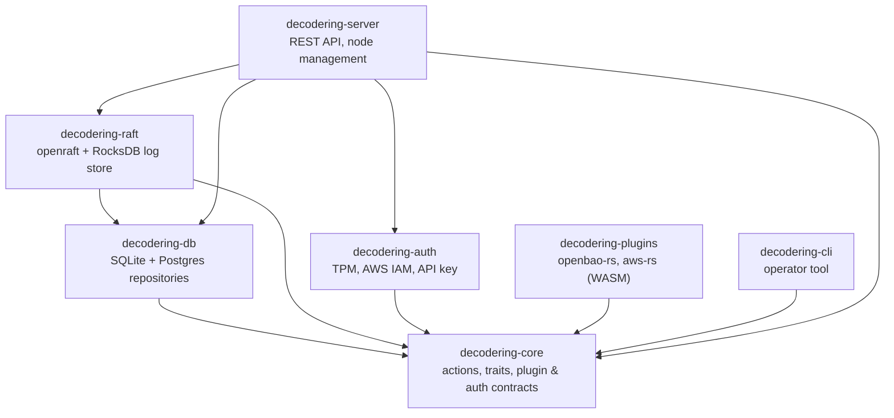
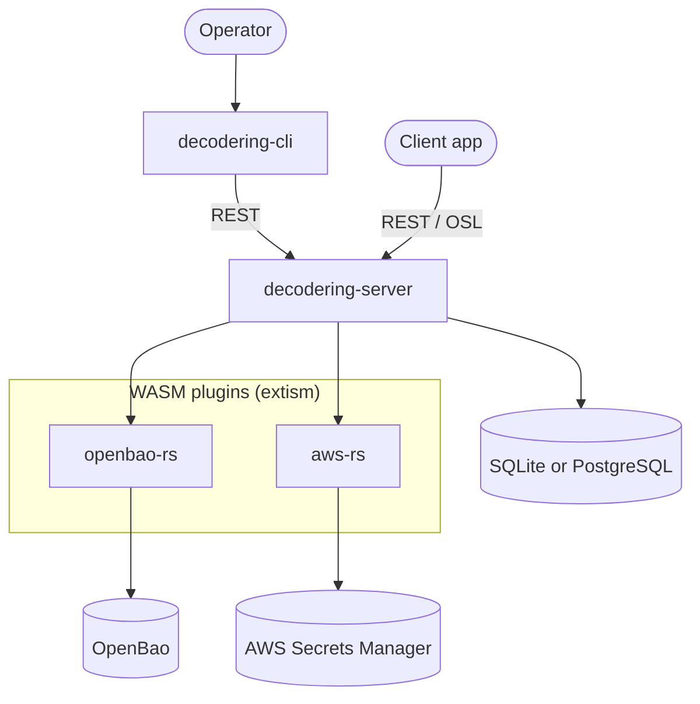
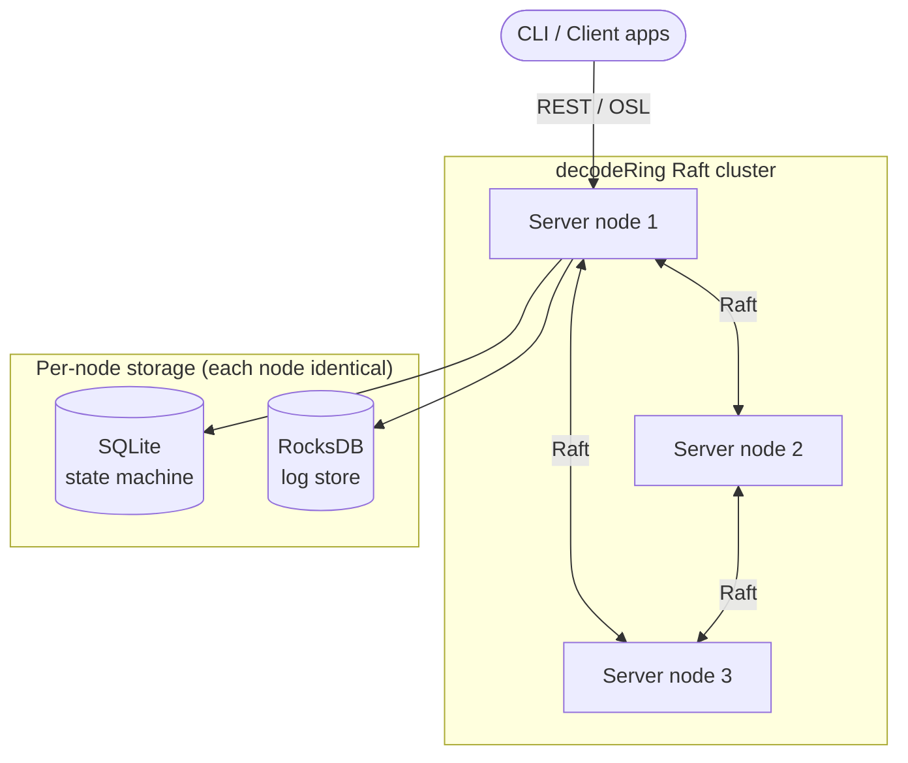

# Architecture

decodeRing (`dcdr`) is a security orchestration layer that fronts multiple
secrets vaults behind a single REST API (the OSL — Open Secrets Language),
with optional Raft replication, pluggable authentication, and pluggable
storage.

## Crate dependency graph

The project is a Cargo workspace. Arrows point from a crate to the crates it
depends on.

## Deployment / component view

The server runs in one of two modes. Both expose the same REST/OSL API and
delegate secret access to sandboxed WASM plugins; they differ only in how
state is stored and replicated.

### Single mode

One node talks directly to a single SQLite **or** PostgreSQL database.

### Raft mode

Multiple nodes replicate state via Raft. Each node keeps its **own** SQLite
state machine and RocksDB log store. Secret-backend access (plugins → vaults)
works exactly as in single mode and is omitted here for clarity.

