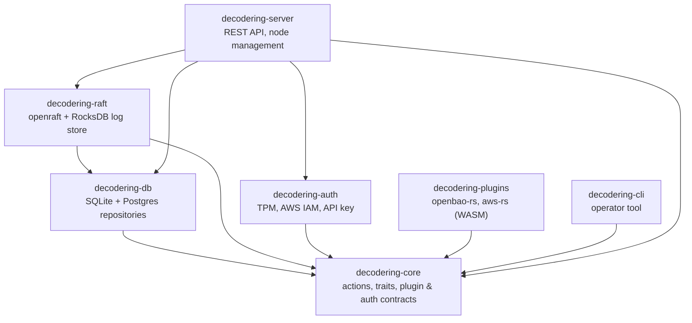

# Architecture

decodeRing (`dcdr`) is a security orchestration layer that fronts multiple
secrets vaults behind a single REST API (the OSL — Open Secrets Language),
with optional Raft replication, pluggable authentication, and pluggable
storage.

## Crate dependency graph

The project is a Cargo workspace. Arrows point from a crate to the crates it
depends on.

